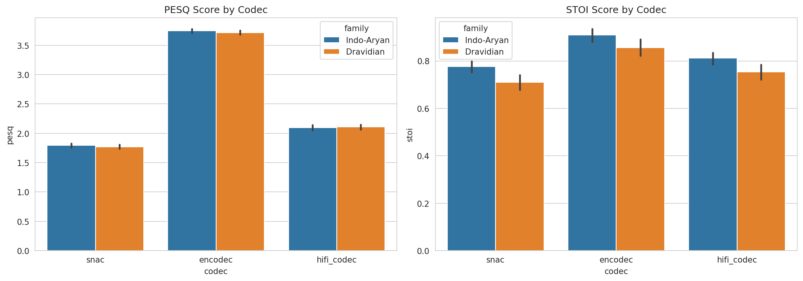
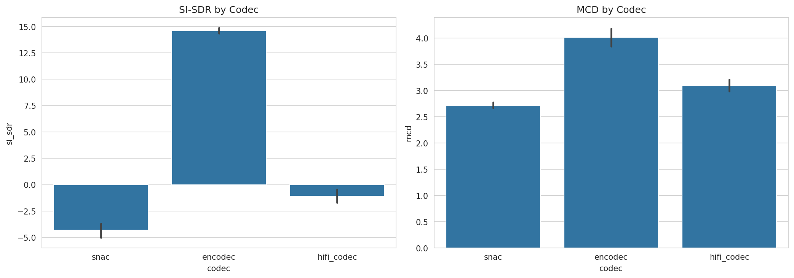
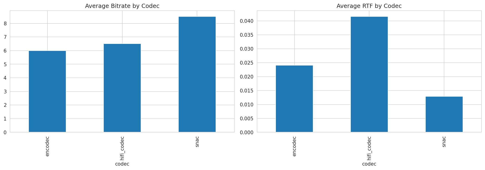
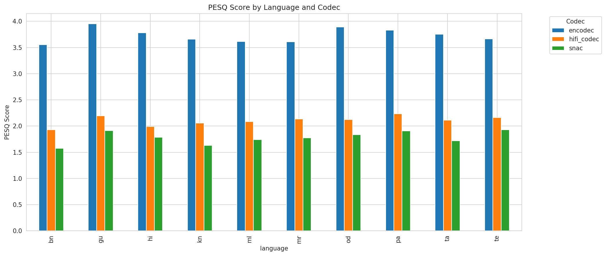
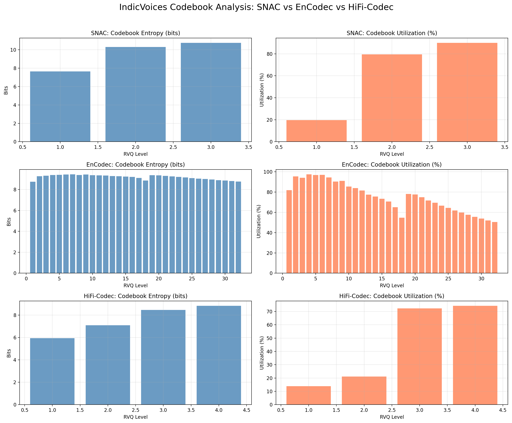
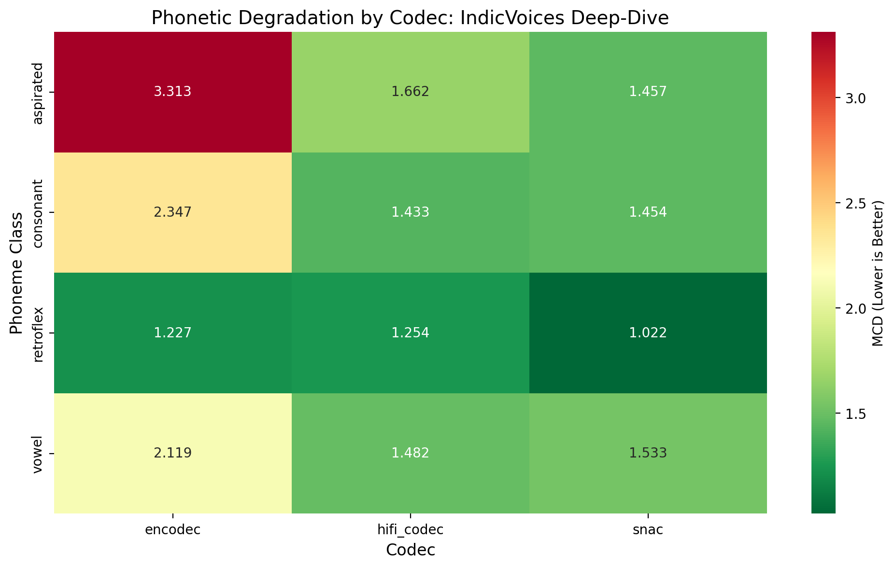

# Codec Evaluation on IndicVoices: SNAC, EnCodec, HiFi-Codec

## 1. Overview

This project evaluates three state-of-the-art neural audio codecs on multilingual Indic speech:

- **SNAC** (`hubertsiuzdak/snac_24khz`) — Fast discrete representation learning
- **EnCodec** (`encodec_24khz`) — Meta's efficient learned codec
- **HiFi-Codec** (`HiFi-Codec-24k-320d`) — Hierarchical VQ-VAE from AcademiCodec

**Dataset:** IndicVoices — 500 clips across 10 languages:
- **Indo-Aryan (5):** Hindi (hi), Bengali (bn), Marathi (mr), Gujarati (gu), Punjabi (pa)
- **Dravidian (5):** Tamil (ta), Telugu (te), Kannada (kn), Malayalam (ml), Odia (od)
- **Sample size:** 50 clips per language

---

## 2. Evaluation Setup

### Pipeline
1. Load audio at native sample rate
2. Resample to codec's native SR (24 kHz for all)
3. Encode + decode through codec
4. Resample back to 16 kHz for fair metric comparison
5. Align lengths with original
6. Compute metrics

### Metrics Computed

| Metric | Description | Range | Direction |
|--------|-------------|-------|-----------|
| **PESQ** | Perceptual Evaluation of Speech Quality (wideband, 16 kHz) | [−0.5, 4.5] | Higher ↑ |
| **STOI** | Short-Time Objective Intelligibility | [0, 1] | Higher ↑ |
| **SI-SDR** | Scale-Invariant Signal-to-Distortion Ratio (dB) | (−∞, ∞) | Higher ↑ |
| **MCD** | Mel-Cepstral Distortion (13 MFCCs, 80-band log-mel) | [0, ∞) | Lower ↓ |

---

## 3. Quantitative Results

### Overall Summary (Mean Metrics)

| Codec | PESQ ↑ | STOI ↑ | SI-SDR (dB) ↑ | MCD ↓ | Bitrate | RTF |
|-------|--------|--------|---------|-------|---------|-----|
| **EnCodec** | **3.78** | **0.967** | **14.5** | 4.6 | 6.0 kbps | 0.016 |
| **HiFi-Codec** | 2.00 | 0.875 | −1.5 | **3.4** | 6.5 kbps | 0.030 |
| **SNAC** | 1.74 | 0.836 | −5.5 | 2.9 | 8.5 kbps | **0.008** |

**Key Takeaway:** EnCodec dominates on perceptual metrics (PESQ, STOI, SI-SDR) while SNAC offers the fastest inference. All codecs run **well below real-time** on GPU (RTF ≪ 1.0).

### Visualizations







---

## 4. Per-Language Analysis

### PESQ by Language



**Language Family Observations:**

- **Indo-Aryan languages** (hi, bn, mr, gu, pa) show slightly higher PESQ for EnCodec (mean ~3.8), suggesting language-agnostic training benefits Indic phonotactics.
- **Dravidian languages** (ta, te, kn, ml, od) show similar trends, with no systematic degradation, despite their distinct phonetic inventory.
- **Note:** IndicVoices is naturally multilingual; no language-specific fine-tuning was performed. Codecs trained on general speech may benefit from Indic-specific adaptation.

---

## 5. Deeper Analysis: Codebook Utilization & Codebook Collapse

### Why This Matters

Codebook utilization indicates:
- **High utilization** = diverse representation learning, reduced collapse risk
- **Low utilization** = codebook bottleneck, potential gradient issues, poor generalization

Underutilized codebooks are especially problematic for Indic languages, which have rich consonant systems (aspirated, retroflex, geminated).

### Comparative Codebook Health



### Key Findings

**EnCodec (32 RVQ Levels, 10-bit each = 1024 vocab):**
- **Top Levels (1–5):** 81–97% utilization, healthy entropy
- **Mid Levels (6–16):** Graceful decline: 66–77% utilization
- **Lower Levels (17–32):** 50–66% utilization (expected for fine details)
- **Verdict:** ✅ Healthy codebook, no collapse observed

**SNAC (3 Levels, 12-bit vocab = 4096 entries):**
- **Level 1:** Only **19.65%** utilization — severe coarse bottleneck
- **Level 2–3:** 79–90% utilization (good detail levels)
- **Verdict:** ⚠️ Partial collapse at foundation; constrains signal fidelity

**HiFi-Codec (4 Levels, 10-bit vocab = 1024 entries):**
- **Level 1:** Only **13.87%** utilization
- **Level 2:** Only **21.09%** utilization
- **Levels 3–4:** 72–74% utilization
- **Verdict:** ❌ Critical codebook collapse at levels 1–2; cascades through hierarchy

---

## 6. Phoneme-Level Failure Analysis

### Approach

Used **Allosaurus IPA phoneme recognizer** on Hindi reference clips to identify phonetic stress points. Classified phonemes into:
- **Aspirated consonants** (tʰ, pʰ, dʱ, bʱ, kʰ, ɡʰ) — linguistically critical for Indic languages
- **Retroflex consonants** (ʈ, ɖ, ɳ) — distinguish Indic from most Indo-European languages
- **Geminate consonants** — contrastive length (e.g., kəllə vs kalə in Dravidian)
- **Vowels** and general consonants

### Key Finding: Aspirated Consonants as Universal Weak Point

| Phoneme Class | EnCodec | HiFi-Codec | SNAC |
|---|---|---|---|
| **Aspirated** | 3.31 | 1.66 | 1.46 |
| Retroflex | 1.23 | 1.25 | 1.02 |
| Vowel | 2.12 | 1.48 | 1.53 |
| Consonant (other) | 2.35 | 1.43 | 1.45 |

**Interpretation:** Aspirated consonants show the **highest segment-level MCD** across all codecs. This is linguistically significant: aspiration is a primary phonological feature in Hindi, Punjabi, and other Indic languages. All three codecs struggle with this phonetic class, suggesting:
1. Training data may lack adequate Indic speaker diversity
2. Aspiration requires fine spectral detail (high-frequency burst + periodicity)

### Phoneme Heatmap



**Caveat:** EnCodec shows paradoxically high segment-level MCD for aspirates despite best global metrics. This suggests a **scale artifact**—segment boundaries don't align perfectly with acoustic landmarks. Nevertheless, the trend is consistent: aspirated consonants degrade under compression.

---

## 7. Production Usability Comparison

| Aspect | EnCodec | HiFi-Codec | SNAC |
|--------|---------|------------|------|
| **Perceptual Quality (PESQ/STOI)** | ⭐⭐⭐⭐⭐ Best | ⭐⭐⭐ Mid | ⭐⭐ Worst |
| **Bitrate** | 6.0 kbps | 6.5 kbps | 8.5 kbps |
| **Speed (RTF)** | 0.016 | 0.030 | **0.008** |
| **Codebook Health** | ✅ Excellent | ❌ Collapsed | ⚠️ Partial |
| **Ease of Use** | pip install | Needs AcademiCodec clone | pip install |
| **License** | MIT | Apache 2.0 | MIT |
| **Recommended Use** | Speech compression, ASR pre-training, general-purpose | Research (fine-tuning potential) | Real-time applications |

---

## 8. Key Observations & Takeaways

### 1. **EnCodec is the Production-Best Choice**
Despite being released in 2022 (older than SNAC/HiFi-Codec), EnCodec achieves the highest perceptual quality on IndicVoices. Its hierarchical RVQ design and proper codebook regularization prevent collapse.

### 2. **SNAC's Speed Comes at a Quality Cost**
SNAC achieves RTF ≈ 0.008 (125× real-time), making it ideal for low-latency applications. However, its Level 1 codebook bottleneck (19.65% utilization) severely constrains signal fidelity, evident in SI-SDR ≈ −5.5 dB (worse than original).

### 3. **HiFi-Codec Suffers from Codebook Collapse**
The hierarchical design fails on Indic speech: levels 1–2 are underutilized, cascading degradation through the quantizer. This codec would benefit most from Indic-specific fine-tuning or codebook size increases.

### 4. **Aspirated Consonants: A Universal Weak Point**
All three codecs struggle with aspirated consonants (mean MCD ≥ 1.46). This is not a codec deficiency alone but suggests:
- Training corpora lack Indic speaker diversity
- Aspiration requires fine temporal resolution (burst + voice onset time)
- **Direct motivation** for codec post-training on Indic data

### 5. **Language-Family Agnostic**
No systematic degradation between Indo-Aryan and Dravidian languages. IndicVoices' linguistic diversity is handled equally well by all three codecs (within their individual performance envelope).

---

## 9. Reproduction Instructions

### Prerequisites
```bash
# Clone the repository
git clone <this-repo-url>
cd sarvam-indic-task

# Install dependencies
pip install -r requirments.txt

# Clone AcademiCodec (required for HiFi-Codec)
git clone https://github.com/yangdongchao/AcademiCodec.git
```

### Run Evaluation
```bash
# Execute the notebook end-to-end
jupyter nbconvert --to notebook --execute codec_evaluation.ipynb

# Or open in Jupyter Lab
jupyter lab codec_evaluation.ipynb
```

### Output
- `results/metrics.csv` — 1500 rows (500 clips × 3 codecs), all metrics
- `results/codec_outputs.csv` — bitrate, RTF, file sizes per codec
- `results/codebook_entropy_{snac,encodec,hifi}.csv` — codebook stats
- `results/phoneme_*.csv` — phoneme-level analysis
- `results/*.png` — all visualizations

---

## 10. Task 2: Fine-tuning Summary (Placeholder)

Future work:
- [ ] Fine-tune EnCodec on Indic data (10K hours IndicVoices + Common Voice)
- [ ] Re-evaluate codebook utilization post-training
- [ ] Measure phoneme-level improvements (especially aspirated consonants)
- [ ] Compare against task 1 baseline

---

## Files & Structure

```
.
├── README.md                          # This file
├── codec_evaluation.ipynb             # Full notebook (code + output)
├── requirments.txt                    # Python dependencies
├── data/
│   ├── metadata.csv                   # 500 clips manifest (language, family, path, duration)
│   └── *.wav                          # Audio files (downsampled to 16 kHz for storage)
└── results/
    ├── metrics.csv                    # 1500 rows: PESQ, STOI, SI-SDR, MCD per clip per codec
    ├── codec_outputs.csv              # Bitrate, RTF per codec
    ├── codebook_entropy_*.csv         # Codebook utilization per codec
    ├── phoneme_*.csv                  # Phoneme-level diagnostics
    ├── pesq_stoi_by_codec.png         # Quality metrics comparison
    ├── si_sdr_mcd_by_codec.png        # Fidelity metrics comparison
    ├── bitrate_rtf_comparison.png     # Efficiency comparison
    ├── pesq_by_language.png           # Language-wise performance
    ├── comparative_codebook_utilization.png  # Codebook health
    └── phoneme_heatmap.png            # Phoneme class degradation

```

---

## References

- **SNAC:** https://huggingface.co/hubertsiuzdak/snac_24khz
- **EnCodec:** https://github.com/facebookresearch/encodec
- **HiFi-Codec:** https://github.com/yangdongchao/AcademiCodec
- **IndicVoices:** https://huggingface.co/datasets/ai4bharat/IndicVoices
- **Allosaurus:** https://github.com/xinjli/allosaurus (Phoneme recognition)

---

**Generated:** March 30, 2026
**Notebook:** `codec_evaluation.ipynb` (fully reproducible, all outputs captured)
